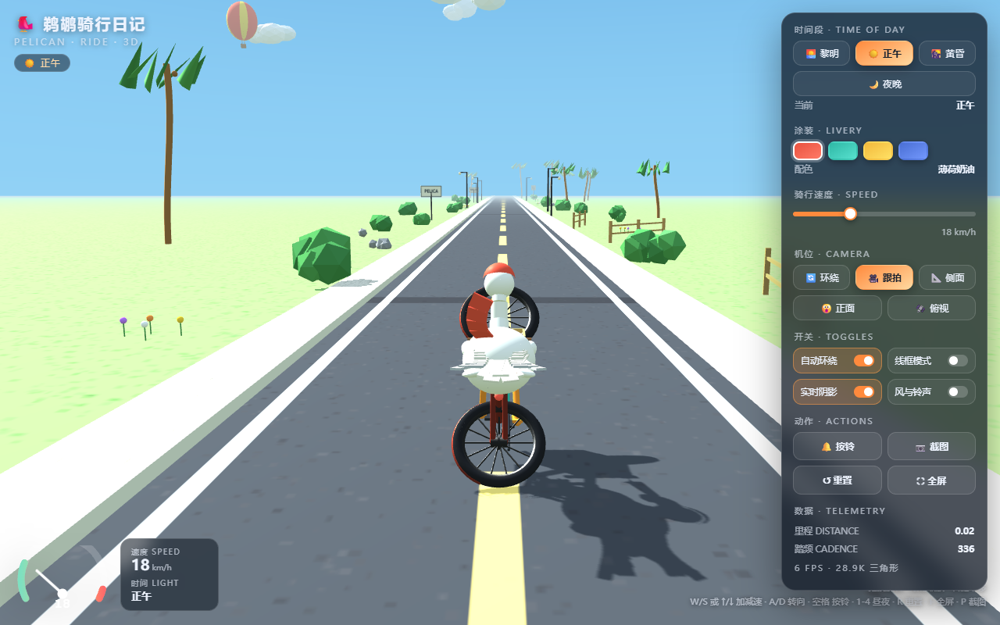
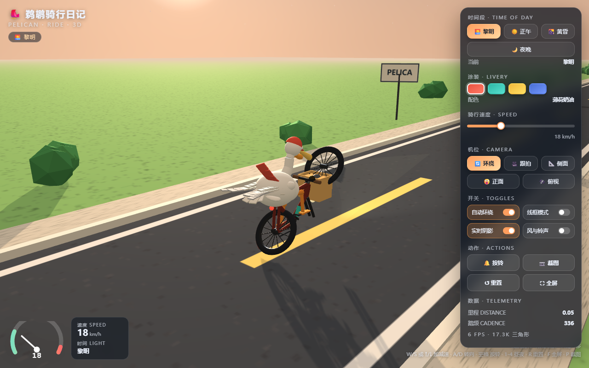
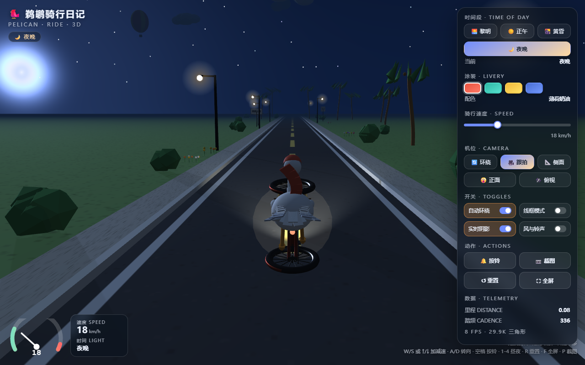

# 🐦 鹈鹕骑行日记 · Pelican Ride 3D

一只戴着水手帽、车筐里装着鱼、翅膀当"扶手"的鹈鹕，骑着一辆复古公路车沿海岸公路前行的**纯程序化 3D 交互场景**。
整个页面只用 Three.js 手写生成，没有任何外部模型 / 贴图资源（`three.min.js` 与 `OrbitControls.js` 除外）。

## 🔗 在线访问

| 入口 | 链接 | 说明 |
| --- | --- | --- |
| **GitHub Pages（主入口）** | https://robotwizardt.github.io/pelican-ride-3d/ | 直接渲染，永久有效，Fastly CDN 加速 |
| **单文件版（GitHub Pages）** | https://robotwizardt.github.io/pelican-ride-3d/pelican-ride.html | 670KB 单文件，同样直接渲染 |
| 单文件版（jsDelivr CDN） | https://cdn.jsdelivr.net/gh/robotwizardt/pelican-ride-3d@main/pelican-ride.html | 下载用（jsDelivr 对 html 返回 text/plain） |
| 镜像 · litterbox | https://litter.catbox.moe/kwt1ah.html | 直接渲染（72 小时，单文件版） |
| 源码仓库 | https://github.com/Robotwizardt/pelican-ride-3d | 含 src/ 构建脚本与回归截图 |

> 说明：GitHub / jsDelivr 对 `.html` 一律以 `text/plain` 返回（防滥用），因此 jsDelivr 那条用于**下载**单文件；
> 需要"打开即玩"请用主入口、Pages 上的单文件版或 litterbox 镜像。

## ✨ 功能一览

- **全程序化建模**：鹈鹕（头/帽/喉囊/喙/眼/颈/身体/双翼/尾/双腿，两段 IK 反向动力学）+ 自行车（车架、前后轮、牙盘链条、曲柄脚踏、车把、坐垫、车筐、鱼、水壶、车铃、夜间车灯）。
- **踩踏同步**：脚掌实时跟随脚踏做两点式 IK 解算，身体随踏频上下起伏、翅膀后掠、喉囊晃动、围巾飘动。
- **昼夜系统**：黎明 / 正午 / 黄昏 / 夜晚四档光照，天空着色器、太阳与月亮、星空、潮汐雾、路灯光晕、夜间前灯光锥与尾灯，全部平滑过渡。
- **海风环境**：风吹粒子、夜间萤火虫、落叶、芦苇、海浪、草坪、棕榈、花丛、灌木、岩石、木桩、护栏、路牌、路灯与远山。
- **多机位**：环绕 / 跟拍 / 侧面 / 正面 / 俯视，带缓动过渡；可拖拽旋转、滚轮缩放、右键平移。
- **HUD 与遥测**：SVG 速度表、里程、踏频、FPS、三角形数、当前时段。
- **声音**：Web Audio 实时合成的车铃声、风声与链条声（可开关）。
- **涂装**：4 套整车配色（珊瑚红 / 薄荷绿 / 柠檬黄 / 鸢尾蓝）。
- **操作**：键盘（`W/S`·`↑/↓` 加减速、`A/D` 转向、`空格` 按铃、`1-4` 昼夜、`R` 重置、`G` 线框、`F` 全屏、`P` 截图）+ 鼠标 / 触屏。
- **响应式**：桌面侧栏面板、移动端底部虚拟按键，自动适配。

## 🚀 本地运行

直接双击 `index.html`（或 `pelican-ride.html`）即可，无需构建、无需服务器。
需要从源码重新构建时：

```bash
node build.js          # src/app*.js -> dist/app.js（terser 压缩）
node build-single.js   # 生成单文件 release/pelican-ride.html
node test.js           # 无头浏览器回归：截图 4 种时段 / 5 种机位 + 移动端布局
```

## 🗂 目录

```
index.html            页面（多文件版入口）
app.js                场景逻辑（压缩后）
three.min.js          Three.js r160
OrbitControls.js      轨道控制器
pelican-ride.html     单文件版（内联全部 JS）
src/                  源码：app.js / app2.js / app3.js / index.tpl.html / style.css / build.js
shots/                回归测试截图
```

## 📸 截图

| 正午环绕 | 黄昏 | 夜晚跟拍 |
| --- | --- | --- |
|  |  |  |

---

*Made with Three.js · 全部几何体由代码生成 · 无外部素材*
